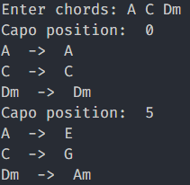

# Input Desired Chords, Outputs Valid Capo Positions

## valid input format:
 - capital letters alone for major chords (e.g., A major -> A)
 - capital letters with a lower case 'm' for minor chords (e.g., A minor -> Am)
 - all accidentals represented sharp (e.g., Dbm -> C#m)
 - separated by spaces (e.g., A Dm C Fm)

## to-do
 - allow user to enter a current capo position and adjust accordingly
 - add additional chord types
 - convert to ipynb or subpage of website